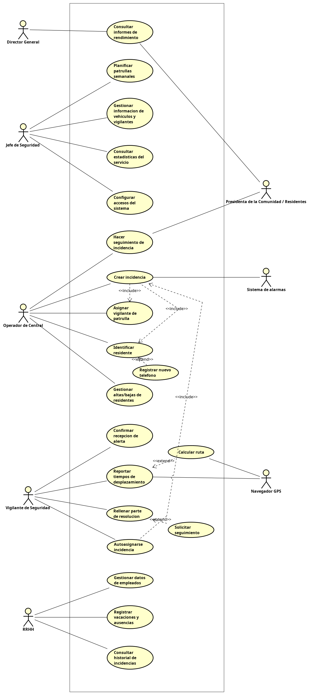

# 10. Modelo de casos de uso: diagrama general

A continuación se presenta el diagrama general de casos de uso del sistema **GesSec S.L.**. Este modelo muestra las interacciones principales entre los distintos actores y los procesos elementales de negocio que el software debe soportar, definiendo claramente la frontera del sistema.

### Resumen de relaciones avanzadas:

**Relaciones de Inclusión (`<<include>>`):**
* **Crear incidencia** `<<include>>` **Identificar residente:** No se puede registrar y abrir una incidencia en el sistema sin haber identificado previamente a la persona que da el aviso.
* **Crear incidencia** `<<include>>` **Asignar vigilante de patrulla:** La gestión inicial de una nueva alerta requiere obligatoriamente que se asigne a un vigilante disponible para que acuda al lugar.
* **Autoasignarse incidencia** `<<include>>` **Crear incidencia:** Si un vigilante detecta una anomalía durante su patrulla y decide hacerse cargo, el sistema debe crear obligatoriamente esa nueva incidencia para poder asignársela.

**Relaciones de Extensión (`<<extend>>`):**
* **Registrar nuevo teléfono** `<<extend>>` **Identificar residente:** Solo se registra un nuevo número de contacto si, durante el proceso de identificación, el operador comprueba que el informante no figura en la base de datos.
* **Solicitar seguimiento** `<<extend>>` **Rellenar parte de resolución:** Al documentar el final de una intervención, el vigilante puede indicar opcionalmente si la incidencia requiere ser vigilada o revisada posteriormente por la central.
* **Calcular ruta** `<<extend>>` **Reportar tiempos de desplazamiento:** Al confirmar que se dirige al lugar, el vigilante puede solicitar de manera opcional que el sistema (apoyándose en el Navegador GPS) le muestre la ruta óptima hacia el destino.