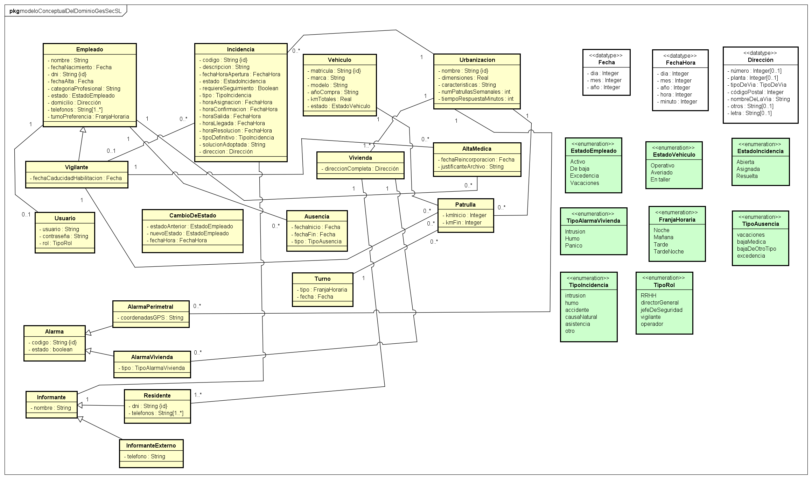

# 13. Modelado Conceptual del Dominio

A continuación se presenta el diagrama de clases correspondiente al modelo conceptual del dominio del sistema GesSec S.L., el cual ha sido diseñado para ser totalmente consistente con los Requisitos de Información.

